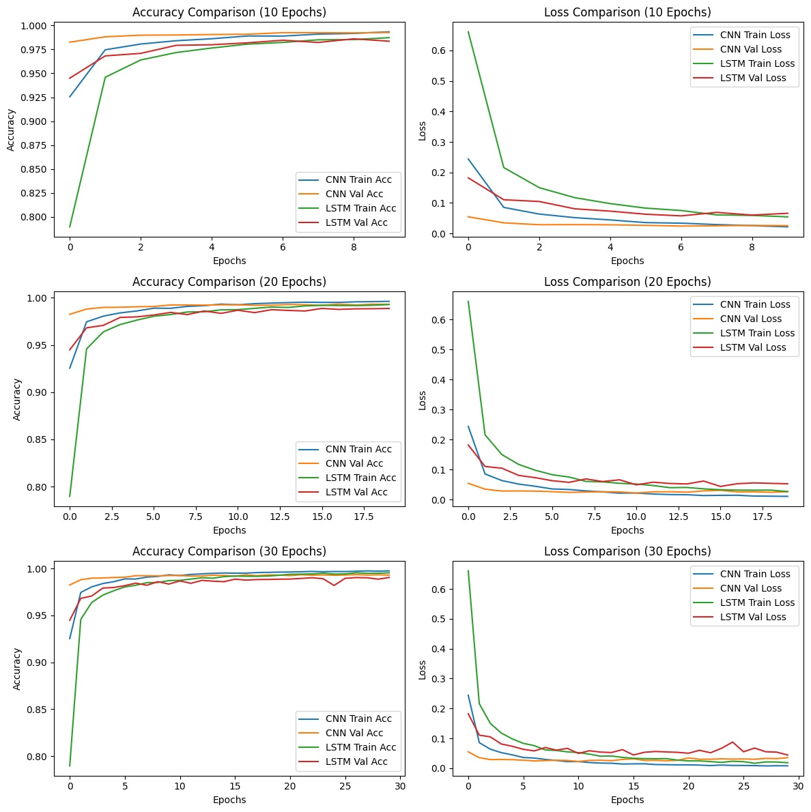

# CNN-LSTM

# Models
- Convolutional Neural Network (CNN): Uses convolutional and pooling layers to extract spatial features from images.
- Long Short-Term Memory (LSTM) : A type of Recurrent Neural Network (RNN) capable of learning long-term dependencies using memory cells. For MNIST, each image (28×28) is treated as a sequence of 28 rows, each row is an input timestep.

---
# Project Steps
- Data Preparation : Images normalized and reshaped. Labels one-hot encoded
- Model Design
  - CNN Architecture:
    `Conv2D → MaxPooling →Conv2D → MaxPooling → Flatten → Dense → Dropout → Dense`
  - LSTM Architecture:
    `LSTM layer → Dropout → Dense → Dropout → Dense`
- Training : Models trained for 10, 20, and 30 epochs.  
- Evaluation : Training and Validation Accuracy/ Loss, Training Time (seconds)
- Visualization : Plotted accuracy/loss vs epochs for comparison.

# Results:
- Model Accuracy Comparison

| Epoch | CNN Train Accuracy | CNN Val Accuracy | LSTM Train Accuracy | LSTM Val Accuracy |
|:------:|:------------------:|:----------------:|:-------------------:|:-----------------:|
| 10 | 0.993317 | 0.9926 | 0.987200 | 0.9835 |
| 20 | 0.996233 | 0.9931 | 0.992850 | 0.9887 |
| 30 | 0.997550 | 0.9930 | 0.995433 | 0.9905 |

- Model Loss Comparison

| Epoch | CNN Train Loss | CNN Val Loss | LSTM Train Loss | LSTM Val Loss |
|:------:|:---------------:|:-------------:|:----------------:|:--------------:|
| 10 | 0.021849 | 0.025828 | 0.054604 | 0.066278 |
| 20 | 0.011048 | 0.026442 | 0.026984 | 0.052981 |
| 30 | 0.007847 | 0.035075 | 0.018266 | 0.044052 |

- Training Time (s)

| Model | Training Time (s) |
|:------:|:-----------------:|
| CNN | 316.656794 |
| LSTM | 602.868776 |

---
# Analysis of Differences
- Convergence Speed
  - CNN converged faster and achieved higher accuracy in fewer epochs.  
  - LSTM required more time to reach comparable performance.

- Loss 
  - CNN consistently maintained lower training and validation loss across all epochs.  
  - LSTM displayed a slower decrease in loss, especially during early training.

- Computation Cost
  - LSTM took 2× longer to train due to its sequential processing nature.  
  - CNN resulting faster training times.

---
# Performance:
|   | CNN | LSTM |
|:-----------|:--------|:---------|
| Accuracy |  Higher  | Slightly lower |
| Loss |  Lower | Higher |
| Training Speed |  Faster | Slower |
| Overfitting | Minimal | Slightly in validation |

- Conclusion: For image-based tasks like MNIST, CNNs are more efficient and accurate. LSTMs, while powerful for sequential data, are not as optimized for spatial image patterns.

---
# Improvement and Extension:
- Hybrid Model: Combine CNN + LSTM for sequence-aware feature extraction (e.g., video frame recognition).
- Data Augmentation: (e.g., Use rotation) to improve generalization.
- Regularization: Dropout, Batch Normalization to stabilize training.

